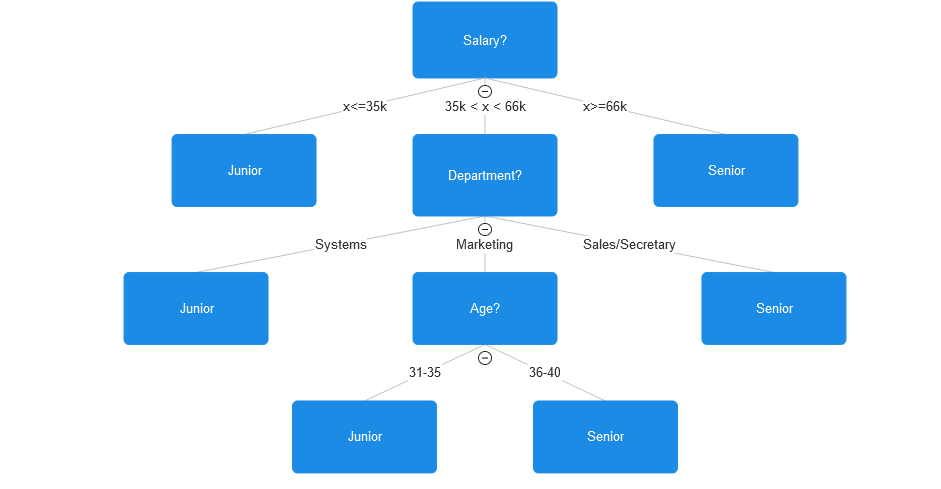
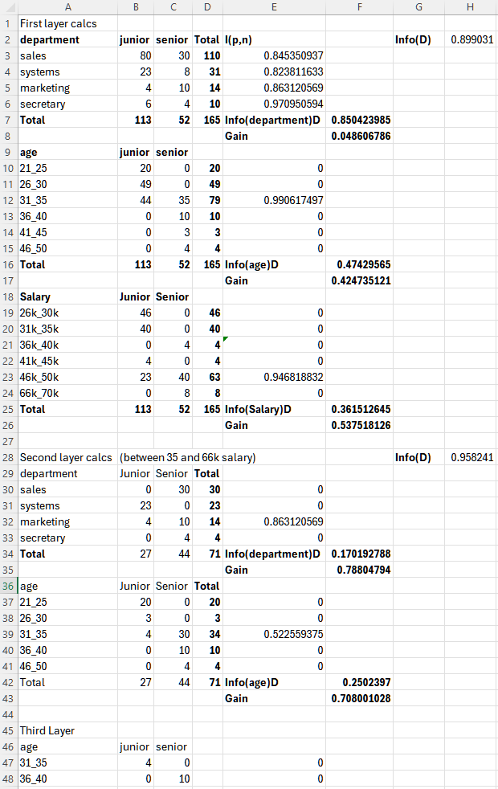

```{r setup, include=FALSE}
knitr::opts_chunk$set(echo = TRUE)


```

## Problem 1
## (a)
```{python}
#Smoothing list of ages by bin mean with a bin depth of three
import numpy as np
#Copy over list
age = [13, 15, 16, 16, 19, 20, 20, 
21, 22, 22, 25, 25, 25, 25, 30, 33, 
33, 35, 35, 35, 35, 36, 40, 45, 46, 
52, 70]

#Create list for bins
bins = []
#Loop through age counting by 3
for i in range(0, len(age), 3):
  #Take 3 ages and calculate mean
  mean = sum(age[i: i+2]) / 3
  #round mean to 2 decimal places to make it neater
  mean = round(mean, 2)
  #Create bin 
  bin = [mean, mean, mean]
  #Place bin in list of bins
  bins.append(bin)
  
#Output bins
for bin in bins:
  print(bin)
```

## (b)
```{python}
#Calculating IQR with Q1 and Q3 to find outliers
Q1 = np.percentile(age, 25)
Q3 = np.percentile(age, 75)
IQR = Q3 - Q1
#Calculate upper and lower limits using IQR
lowlim = Q1 - 1.5 * IQR
upperlim = Q3 + 1.5 * IQR

#Output
print('Q1 equals ', Q1, '\nQ3 equals ', Q3, '\nIQR equals ', IQR,
      '\nBounds for outliers are: (', lowlim, ' ', upperlim, ')')

#Iterate through age checking each value against outlier limits
for i in age:
  if((i > upperlim) or (i < lowlim)):
    print(i, ' is an outlier in age data')
```
## (c)
```{python}
#Use min-max normalization to transform 35 onto the range [0.0, 1.0]
#Min-max normalization
small = min(age)
big = max(age)
normalized = (35 - small) * (1 - 0) / (big - small + (0))


print('35 transformed onto the range [0.0, 1.0] using min-max normalization equals: ', normalized)
```
## (d)
```{python}
#Use z-score normalization to transform 35 for age
avg = sum(age) / len(age)
stdev = np.std(age)

normalized = (35 - avg) / stdev

print('35 transformed using z-score normalization equals: ', normalized)
```
## (e)
```{python}
#Use normalization by decimal scaling to transform the value 35 for age
normalized = 35 / 10**2
print('35 transformed using decimal scaling equals: ', normalized)
```

## Problem 2
```{python}
##Write function to normalize data to new min and max
##Define normalize function
def normalize (list, new_min, new_max):
  
  #printing old data that was given
  print('old data: ')
  for i in list:
    print(i)
    
  #Creating empty list for normalized values  
  normalized_data = []
  
  #Defining old min and max values
  old_min = min(list)
  old_max = max(list)
  
  #iterating through the list and normalizing each value
  for i in list:
    normal = (i-old_min) * (new_max - new_min) / (old_max - old_min + 
              new_min)
              
    #Rounding to 2 decimal places for neatness
    normal = round(normal, 2)
    
    #appending normalized value to list or normalized data
    normalized_data.append(normal)
  
  #printing new normalized data
  print('Normalized data: ')
  for i in normalized_data:
    print(i)
  
#Calling the normalize function on the age list from problem 1. 
#Using 0 and 1 as example range, could be changed to any 2 values
normalize(age, 0, 1)
  
```

## Problem 3
#
#Decision Tree calculations were made in Excel Notebook. Excel file is InformationGainCalc.xlsx
#


## Problem 4
# Generate If-Then rules for decision tree

# Rules:
# R1: IF salary < 35k                                          THEN status = Junior
# R2: IF salary > 66k                                          THEN status = Senior
# R3: IF 35k < salary < 66k AND Department = Systems           THEN status = Junior
# R4: IF 35k < salary < 66k AND Department = Sales             THEN status = Senior
# R5: IF 35k < salary < 66k AND Department = Secretary         THEN status = Senior
# R6: IF 35k < salary < 66k AND Department = Marketing AND age = 31 - 35 THEN status = Junior
# R7: IF 35k < salary < 66k AND Department = Marketing AND age = 36 - 40 THEN status = Senior


